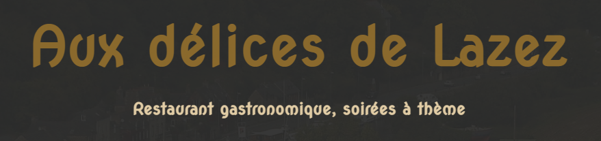
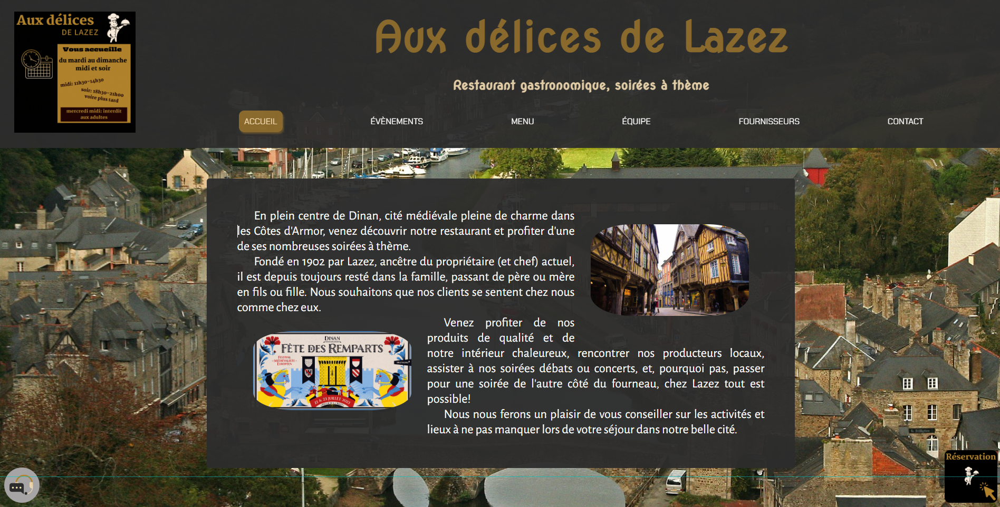
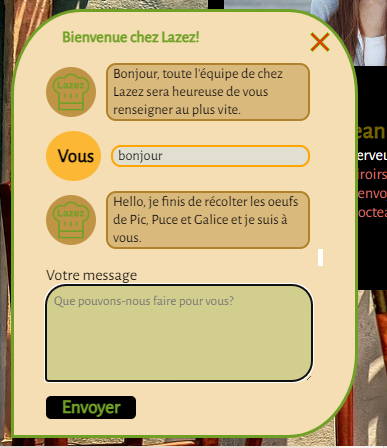
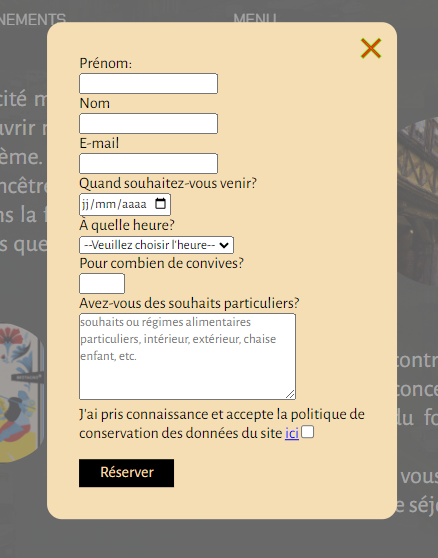

# AUX DÉLICES DE LAZEZ

Application réalisée dans le cadre du concours #6 du Designer du Web

Thème: "RESTAURANT"

- Le concours: [lien Youtube](https://youtu.be/oeM8Y7WTKW0)

## Table des matières

- [Consignes](#consignes)
- [Réalisation](#réalisation)
  - [Technos](#technos)
  - [Détails](#détails)
- [Screenshots](#screenshots)
- [Design](#design)
- [La voir en action](#la-voir-en-action)
- [Moi](#moi)

## Consignes

> Votre travail doit être ORIGINAL et UNIQUE, autant au niveau du DESIGN que du CODE.
> Aucune ressemblance avec quoique ce soit sur le web n'est tolérée, sous peine d'être exclu du concours.
> Partez d'une feuille blanche et tentez de tout créer de A à Z, on doit pouvoir sentir instantanément que tout vient de vous.
>
> Votre création doit également être faite spécialement pour le concours, dans le temps imparti.
> Il est interdit d'utiliser une création qu'on aurait déjà faite, et de participer à un concours avec.
> Ce serait injuste envers ceux qui participent dans le temps imparti.

> Ce site doit obligatoirement contenir les éléments suivants :
>
> - Une page d'accueil présentant le restaurant
> - Un menu (sur une section ou une page propre)
> - Une section ou page de contact avec au minimum : L'adresse, les horaires d'ouverture, un numéro de téléphone et un mail.

## Réalisation

### Technos

- HTML
- CSS
- vanilla JS

### Détails

- Animations en:
  - CSS
  - JS (observer au scroll change la nav)
- Site "one page" avec effet parallax
- Fonctionnalité de chat
- Formulaire de réservation
- Soirées à thème avec possibilité d'ajouter les évènements à l'agenda
- Présentation de l'équipe et des producteurs/fournisseurs
- Menu en ligne et téléchargeable
- Divers moyens de contact, coordonnées et lien vers maps
- Mentions légales et rgpd
- Menu burger (non ça ne se mange pas) pour les petits écrans
- Une dose d'humour, comme toujours

## Screenshots

[UP](#table-des-matières)

## Design

- Choix des couleurs principales: kaki or et anthracite
- Une petite dose de vert et de rouge pour égayer
- Effet parallax sur les fonds d'écran
- Personnalisation des couleurs des icônes

## La voir en action

- Déploiement: [AUX DÉLICES DE LAZEZ](https://aux-delices-de-lazez.netlify.app/)

## Moi

- Website - [Bénédicte Hérault](https://lazez-bzh.netlify.app/)
- LinkedIn - [B. HÉRAULT](https://www.linkedin.com/in/benedicte-herault/)

[UP](#table-des-matières)
